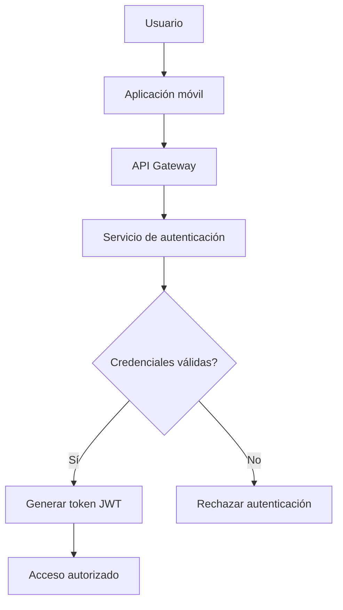

# Prueba de Mermaid

## Arquitectura de autenticación

```mermaid
flowchart TD
    A[Usuario] --> B[Aplicación móvil]
    B --> C[API Gateway]
    C --> D[Servicio de autenticación]
    D --> E{Credenciales válidas?}
    E -->|Sí| F[Generar token JWT]
    E -->|No| G[Rechazar autenticación]
    F --> H[Acceso autorizado]
```
