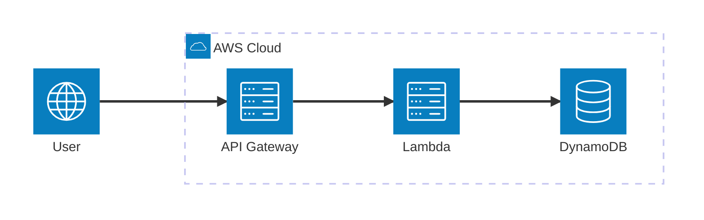

# AWS - Arquitectura básica

```mermaid
architecture-beta
    group aws(cloud)[AWS Cloud]

    service user(internet)[User]
    service api(server)[API Gateway] in aws
    service lambda(server)[Lambda] in aws
    service db(database)[DynamoDB] in aws

    user:R --> L:api
    api:R --> L:lambda
    lambda:R --> L:db
```
